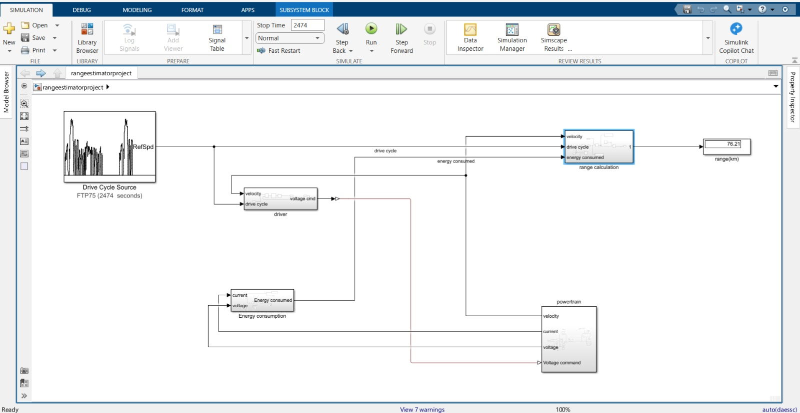
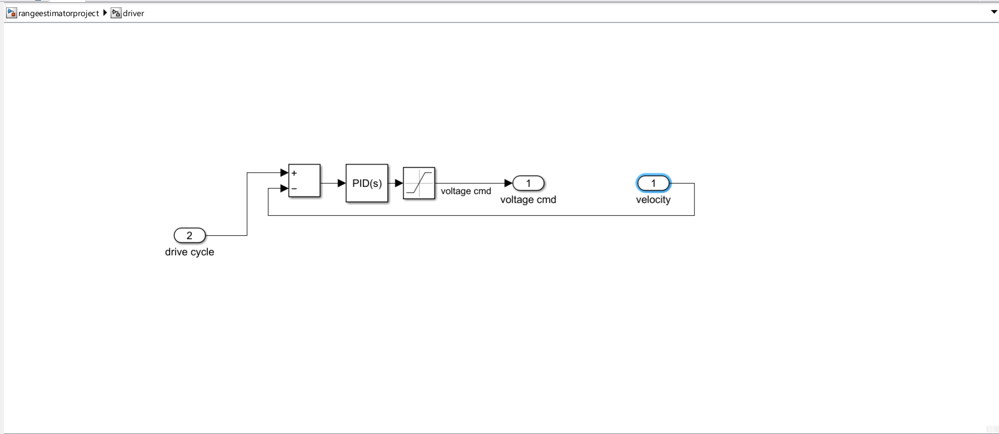
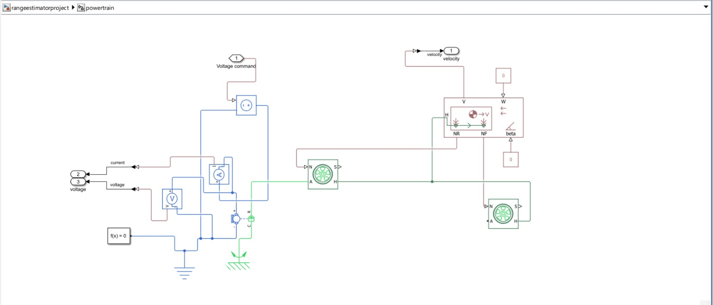
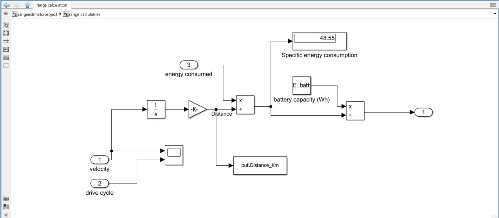

# Ranger
A simple range estimator for a two wheeler ev built in simulink in about two days
## Objective
Estimating the range of an ather 450x ev using a physics based simulink model.
## Architecture

The model is composed of four main blocks excluding the drive cycle and final display block,They are as follows-
### Driver
The driver is the brain of the system and takes in velocity of the vehicle and the required velocity from the drive cycle and sends out a command to the controlled voltage source .

### Powertrain
This block gives us the electrical and mechanical chain of the vehicle,it is important to note that the battery has been replaced with a controlled voltage source as this is a low fidelity model focused on range estimation, Future scope features the inclusion of a full BMS.This block provides velocity,current and voltage as outputs.

### Energy consumption
This block takes in the current and voltage from the powertrain and uses it to get instantaneous power through a product block and energy consumed(Wh) is obtained by putting the instantaneous power through an integrate block.

### Range calculation
The final step in the system, this block uses displacement and energy consumption to get the specific energy consumption which when used to divide the battery capacity given by the constant block gives us range.

### Assumptions
The assumptions for the model are given below and are given in the parameters file.

```
g       = 9.81; (gravity)
m_veh   = 180;  (weight of scooter and a single 70kg passenger)
Crr     = 0.013; (coeffiecient of rolling resistance taken from modern electric,hybrid electric and fuel cell vehicles by Mehrdad Ehsani)
Cd      = 1.0;   (coefficient of drag for a scooter with an upright passenger)
A       = 0.8;    (frontal area of an ather 450x plus a passenger)
rho     = 1.2;    (density of air)
r_wheel = 0.278;  (radius of a 90-12 tire used on an ather 450x)
E_batt  = 3700;   (3.7KWh battery capacity as listed by ather)
Wh_per_J = 1/3600;(conversion for gain block in energy consumption)
km_per_m = 0.001; (meters to kilometers conversion constant for multiply block )
```

### Validation
As compared to Ather's published in city consumption of 30Wh/km using the MIDC this model gives us 48.55 Wh/Km, the higher value can be attributed to the use of the FTP75 drive cycle that is not particularly suited to scooter/moped testing.Furthermore direct motor losses are present due to the lack of gearing and unmodelled regen braking.
### Limitations
The model has a couple of Limitations preventing it from being a full scale Electric vehicle simulation-
The powertrain is idealized with a controlled voltage source and thus is unable to give us SOC,battery temperature or health,
The drive cycle used is not ideal for moped testing.FTP75 was used due to a lack of sources on the MIDC,
DC motor is directly connected with no gears unlike in real world ev's.
### Future scope
The future scope of the project involves turning this model into a proper high fidelity simulation for an ev scooter and addressing the listed limitations.
### HOW TO RUN
download the slx file and the params.m file,
open the slx file, the params m file is loaded in automatically via PreLoadFcn.
